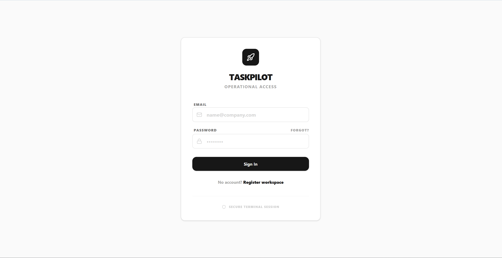
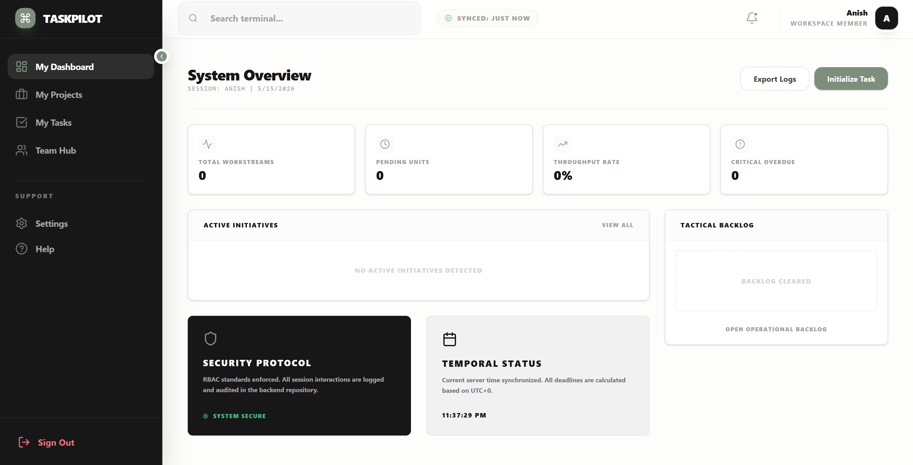
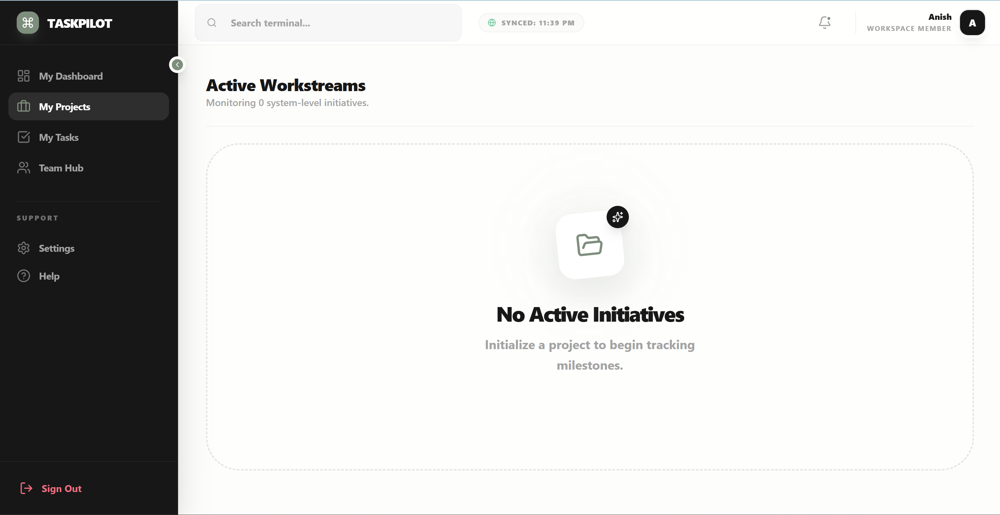
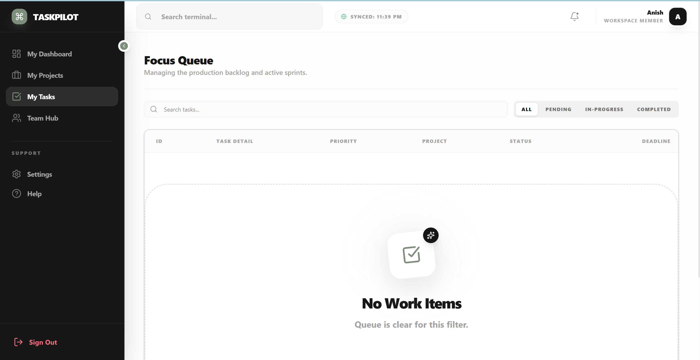

# TaskPilot

TaskPilot is a full-stack task management application built using the MERN stack.  
It helps teams manage projects, organize tasks, track progress, and generate task descriptions using Google Gemini AI.

The project focuses on practical workflows, responsive UI, and clean CRUD functionality.

---

## Live Demo

🔗 https://your-live-url.vercel.app

## Repository

🔗 https://github.com/yourusername/TaskPilot

---

## Demo Credentials

| Role | Email | Password |
|------|------|------|
| Admin | admin@taskpilot.ai | password123 |

---

## Features

- JWT authentication
- Role-based access (Admin / Member)
- Project and task management
- Task status tracking
- AI-generated task descriptions using Gemini API
- Dashboard overview and analytics
- Responsive UI
- Loading and empty states
- Protected routes

---

## Tech Stack

### Frontend
- React + Vite
- Tailwind CSS
- Axios
- React Router
- Recharts

### Backend
- Node.js
- Express.js
- MongoDB Atlas
- Mongoose
- JWT Authentication
- Google Gemini API

---

## Project Structure

```bash
TaskPilot/
│
├── backend/
│   ├── controllers/
│   ├── middleware/
│   ├── models/
│   ├── routes/
│   ├── services/
│   └── server.js
│
├── frontend/
│   ├── src/
│   │   ├── api/
│   │   ├── components/
│   │   │   ├── layout/
│   │   │   └── ui/
│   │   ├── features/
│   │   ├── routes/
│   │   └── utils/
│
└── README.md
```

---

## Environment Variables

Create a `.env` file in the backend directory.

```env
PORT=5000

MONGO_URI=your_mongodb_connection_string

JWT_SECRET=your_jwt_secret

GEMINI_API_KEY=your_gemini_api_key

VITE_API_URL=http://localhost:5000/api
```

---

## Installation

Clone the repository:

```bash
git clone https://github.com/yourusername/TaskPilot.git
```

Move into the project folder:

```bash
cd TaskPilot
```

Install dependencies:

```bash
npm install
```

---

## Run the Application

### Backend

```bash
cd backend
npm run dev
```

### Frontend

```bash
cd frontend
npm run dev
```

---

## Core Functionalities

### Authentication
- Login and signup
- Protected routes
- JWT-based session handling

### Project Management
- Create and manage projects
- Track project progress
- Organize workflows

### Task Workflow
- Create and update tasks
- Manage priorities and deadlines
- Filter tasks by status

### AI Integration
- Generate task descriptions from task titles
- Improve workflow speed using Gemini AI

---

## Screenshots

### Login Page


### Dashboard


### Projects


### Tasks


---

## Future Improvements

- Drag-and-drop task board
- Activity logs
- Email notifications
- Mobile optimization

---

## License

MIT License